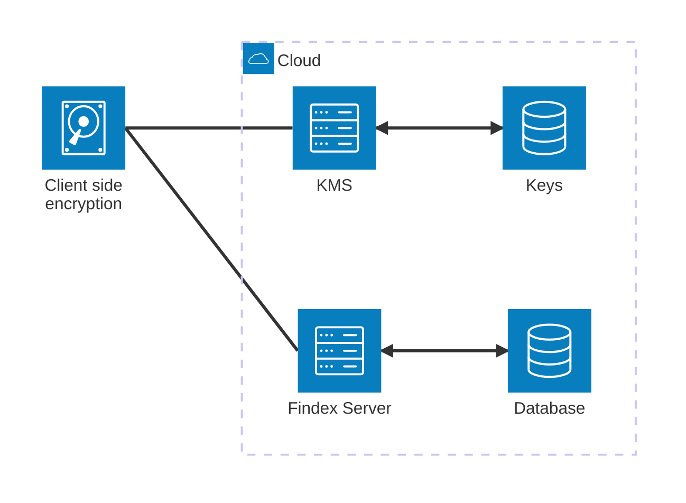
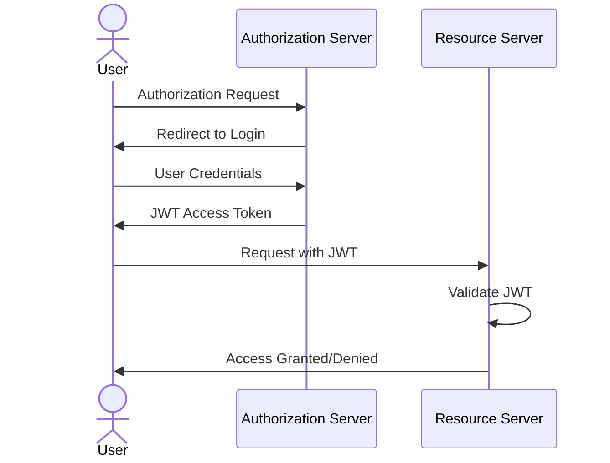
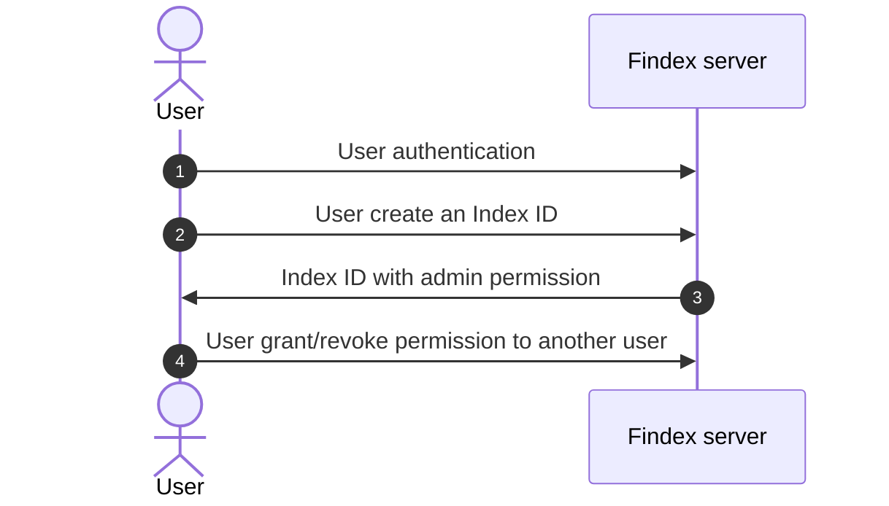
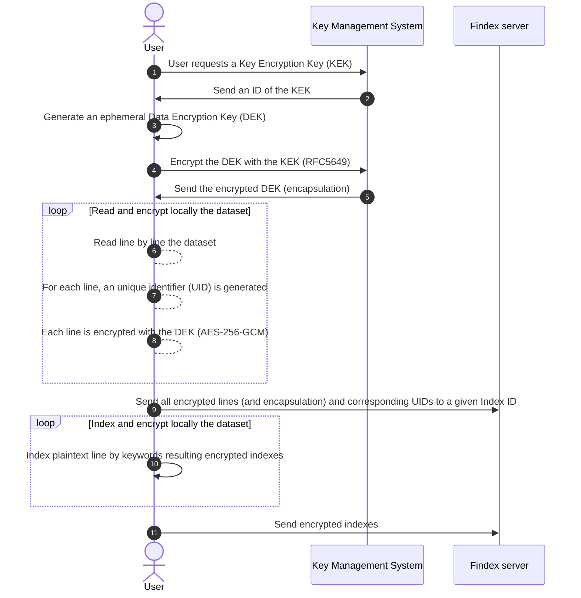
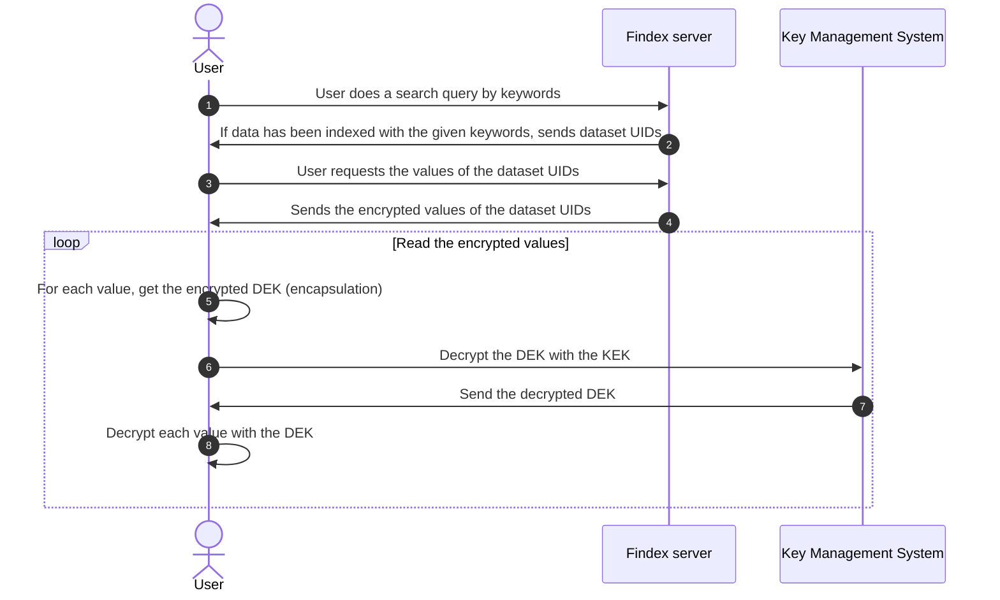

# Cosmian Findex server


- [Cosmian Findex server](#cosmian-findex-server)
  - [What is Findex?](#what-is-findex)
    - [Attacking Model](#attacking-model)
  - [Quick Start](#quick-start)
    - [Docker](#docker)
    - [Pre-built binaries](#pre-built-binaries)
    - [From source](#from-source)
  - [Findex server](#findex-server)
    - [Client-Side Encryption](#client-side-encryption)
      - [How It Works](#how-it-works)
      - [Benefits](#benefits)
    - [Features](#features)
    - [User Authentication](#user-authentication)
      - [OpenID with JWT Access Token](#openid-with-jwt-access-token)
      - [X509 certificates authentication](#x509-certificates-authentication)
    - [User access authorization](#user-access-authorization)
      - [What is an Index ID?](#what-is-an-index-id)
      - [Permissions](#permissions)
      - [Endpoints](#endpoints)
    - [Encrypted database](#encrypted-database)
      - [How to securely index new data?](#how-to-securely-index-new-data)
      - [How to securely search indexed data?](#how-to-securely-search-indexed-data)
        - [Store and retrieve encrypted indexes as Findex requirements](#store-and-retrieve-encrypted-indexes-as-findex-requirements)
        - [Store and retrieve the encrypted version of the data that has been indexed](#store-and-retrieve-the-encrypted-version-of-the-data-that-has-been-indexed)
    - [Configuration file](#configuration-file)
      - [Example without authentication](#example-without-authentication)
      - [Example with X509 authentication](#example-with-x509-authentication)
      - [Example with OpenID authentication](#example-with-openid-authentication)
      - [Usage](#usage)
  - [Findex CLI](#findex-cli)
  - [TODO](#todo)

## What is Findex?

Findex is a cryptographic protocol designed to make search queries on an untrusted cloud server securely. Findex is concurrent and database-independent, allowing large database indexes to be outsourced securely without compromising usability.

Findex aims to solve the following problem:

> [!IMPORTANT]
> How to securely recover the _location_ of an encrypted data matching a given _keyword_?

Findex has been published as a scientific paper in the IACR ePrint archive: <https://eprint.iacr.org/2024/1541>.

### Attacking Model

The attacking model for Findex assumes that the cloud server is untrusted and may attempt to infer information from the encrypted indexes and search queries. However, the server is considered honest-but-curious, meaning it will follow the protocol correctly but will try to learn as much as possible from the data it processes. Findex is designed to protect against such adversaries by ensuring that no useful information about the plaintext data or search queries is leaked.

> [!IMPORTANT]
> Basically, the server does not know how are encrypted the indexes nor the datasets they contain. It can only perform search queries on the encrypted indexes and return the results to the client.

## Quick Start

Multiple options are available to run the Findex server, including using Docker, pre-built binaries, or building from source.

> [!WARNING]
> No authentication is configured for quick start. This is not recommended for production use.

### Docker

The quickest way to get started with Findex server is to use the Docker image. To run the server binary on `http://localhost:6668` that stores its data
in a Redis server, run the following command:

```sh
docker compose -f docker-compose-quick-start.yml up
```

where `docker-compose-quick-start.yml` is the following:

```yaml
services:
  redis:
    container_name: redis
    image: redis:latest
    ports:
      - 6379:6379
  findex-server:
    container_name: findex-server
    image: ghcr.io/cosmian/findex-server:0.1.0
    ports:
      - 6668:6668
    environment:
      FINDEX_SERVER_DATABASE_TYPE: redis
      FINDEX_SERVER_DATABASE_URL: redis://redis:6379
      FINDEX_SERVER_CLEAR_DATABASE: true

```

### Pre-built binaries

An other option include running the server binary directly or building it from source: pre-built binaries [are available](https://package.cosmian.com/findex-server/0.1.0/) for Linux, MacOS, and Windows.

First, run the Redis server independently:

```sh
docker run -d -p 6379:6379 redis
```

Then, download the binary for your platform and run it:

```sh
wget https://package.cosmian.com/findex-server/0.1.0/ubuntu_24_04-release.zip
unzip ubuntu_24_04-release.zip
./ubuntu_24_04-release/cosmian_findex_server -- --database-url redis://localhost:6379 --database-type redis
```

The server should now be running on `http://localhost:6668`.

### From source

To build the server from source, clone the repository and run the following commands:

```sh
git clone https://github.com/Cosmian/findex-server.git
cd findex-server
cargo build
```

First, run the Redis server independently:

```sh
docker run -d -p 6379:6379 redis
```

Then, run the server:

```sh
cargo run --bin cosmian_findex_server -- --database-url redis://localhost:6379 --database-type redis
```

## Findex server

### Client-Side Encryption

Client-side encryption is a crucial aspect of the Findex protocol, ensuring that data remains secure even when stored on an untrusted server. In this model, all encryption and decryption operations are performed on the client side, meaning that the server only ever sees encrypted data and cannot infer any useful information from it.

#### How It Works

1. **Data Encryption**: Before sending any data to the Findex server, the client encrypts the data using a secure encryption algorithm. This ensures that the plaintext data is never exposed to the server.

2. **Index Encryption**: Similarly, the indexes used for search queries are also encrypted on the client side. This prevents the server from learning anything about the content of the indexes.

3. **Search Queries**: When performing a search query, the client encrypts the search keyword and sends the encrypted query to the server. The server processes the query on the encrypted indexes and returns the encrypted results to the client.

4. **Data Decryption**: Upon receiving the encrypted results from the server, the client decrypts the data to obtain the plaintext results.

#### Benefits

- **Data Privacy**: Since the server only handles encrypted data, it cannot access the plaintext information, ensuring data privacy.
- **Security**: Client-side encryption protects against potential data breaches on the server, as the encrypted data would be useless to an attacker without the decryption keys.
- **Control**: Users retain full control over their encryption keys and can manage their own security policies.

By leveraging client-side encryption, Findex ensures that sensitive data remains secure and private, even when stored and processed on an untrusted server.

The Findex server, written in Rust and using the Actix-web framework, is a REST-API server used to store encrypted indexes and perform search queries on them. It is designed to be used in conjunction with the Findex CLI, which is a command-line interface that allows users to interact with the server.



### Features

The server offers a REST API with the following functionalities:

- **User authentication**
- **User access authorization**
- **Store and retrieve encrypted indexes as Findex requirements**
- **Store and retrieve the encrypted version of the data that has been indexed**

### User Authentication

The application supports two methods of user authentication:

- [Open ID Connect](https://openid.net/connect/) with [JWT access tokens](https://jwt.io/)
- PKCS12 certificates with mutual authentication (client ↔ server)

#### OpenID with JWT Access Token

In that case, the Findex server delegates the authentication process to an external OAuth2 server. In fine, the server issues a JWT Access Token that is used to authenticate the user with the Findex server.

> [!WARNING]
> The Findex server must be run with the following arguments:
>
> For example with Google OAuth2:
>
> ```sh
> docker run -p 66688:6668 --name findex-server ghcr.io/cosmian/findex-server:0.1.0 \
>            --jwt-issuer-uri=https://accounts.google.com \
>            --jwks-uri=https://www.googleapis.com/oauth2/v3/certs \
>            --jwt-audience=cosmian_kms
> ```

The authentication Flow can be summarized as follows:

1. Client Requests Authorization:

    The client application initiates an authorization request. This is done via an OAuth 2.0 Authorization Code Flow. The client redirects the user to the Authorization Server (e.g., Google, GitHub, or a custom server) that has to be owned by the client.

2. User Authenticates:

    The user authenticates with their credentials (e.g., username/password, social login). The Authorization Server verifies the user's identity.

3. Access Token Issuance (JWT)

    The Authorization Server issues an Access Token in the form of a JWT. The token contains:

    - Header: Token type (JWT) and signing algorithm (e.g., RS256).
    - Payload (Claims): User information, permissions, expiration time (exp), issuer (iss), audience (aud), etc.
    - Signature: Ensures the integrity and authenticity of the token.

4. Client Accesses Protected Resources

    The client includes the JWT in the Authorization header of HTTP requests to the Resource Server:

    ```html
    Authorization: Bearer <JWT Access Token>
    ```

5. Token Validation

    The Resource Server validates the JWT by:

    - Verifying the signature (using a public key if signed with RS256).
    - Checking standard claims (e.g., exp, iss, aud) for validity.
    - Decoding the payload to extract user information and permissions.

6. Access Granted or Denied

    If the JWT is valid, the Resource Server allows access to the requested resources based on the user's claims. If invalid (e.g., expired, tampered), the request is denied with an HTTP 401 Unauthorized error.



> [!NOTE]
> JWT is a compact, URL-safe means of representing claims to be transferred between two parties. The claims in a JWT are encoded as a JSON object that is used as the payload of a JSON Web Signature (JWS) structure or as the plaintext of a JSON Web Encryption (JWE) structure. This enables the claims to be digitally signed or integrity protected with a Message Authentication Code (MAC) and/or encrypted.

Cosmian CLI is helpful to authenticate with the Findex server using OpenID Connect.

> [!TIP]
> The Cosmian CLI realizes this authentication flow using this simple command:
>
> ```sh
> cosmian findex login
> ```

#### X509 certificates authentication

In that case, the Findex server uses PKCS12 certificates to authenticate the user. The server requires the client to present a certificate signed by a trusted authority known by itself. The server also presents its own certificate to the client, which the client must verify.

> [!WARNING]
> The Findex server must be run with the following arguments:
>
> For example with Google OAuth2:
>
> ```sh
> docker run -p 66688:6668 --name findex-server ghcr.io/cosmian/findex-server:0.1.0 \
>            --https-p12-file=server/certificate.p12 \
>            --https-p12-password=complex_password \
>            --authority-cert-file=server/ca.crt
> ```

### User access authorization

Once authenticated, users must have an authorization to an **Index ID**.

#### What is an Index ID?

An **Index ID** allows the partitioning of indexed data: behind an **Index ID**, there are:

- encrypted indexes
- and the encrypted version of the data that has been indexed.

This **Index ID** can be shared between users, with a specific permission. Users can also own multiple Index IDs.

For each server's endpoint, the server checks the user's permissions before allowing access to the index.

#### Permissions



There are 3 permissions:

- `reader`
- `writer`
- `admin`

The mechanism is pretty simple:

When a user create a new **Index ID**, he becomes the **admin** of this index. He can then grant other users to the index with a role of **reader**, **writer** or **admin**.

Every server endpoint is protected by this authorization mechanism: the server checks the user's role before allowing access to the endpoint.

#### Endpoints

| Endpoint                                              | Description                                       |
| ----------------------------------------------------- | ------------------------------------------------- |
| `/create/index`                                       | Create an **Index ID**                            |
| `/permission/grant/{user_id}/{permission}/{index_id}` | Grant a permission to a user for a specific index |
| `/permission/list/{user_id}`                          | List permissions of a user                        |
| `/permission/revoke/{user_id}/{index_id}`             | Revoke a user's permission for a specific index   |

### Encrypted database

From the server's perspective, only encrypted data is received and stored as-is. The server does not know how the data is encrypted and cannot decrypt it.

The requirements database is a key-value store where the keys are unique identifiers (UIDs) and the values are the encrypted indexes or datasets.

In this scenario, the user is responsible for encrypting the data before sending it to the server. A hybrid encryption scheme is used, where the data is encrypted with a Data Encryption Key (DEK) and the DEK is encrypted with a Key Encryption Key (KEK).

User requires a Key Management System to encrypt the Data Encryption Key (DEK).

#### How to securely index new data?

> [!NOTE]
> The user is already authenticated and has the `write` permission to a given index.



> [!WARNING]
> For now, only Redis database is supported.

#### How to securely search indexed data?

> [!NOTE]
> The user is already authenticated and has the `write` permission to a given index.



##### Store and retrieve encrypted indexes as Findex requirements

According the Findex REST client implementation found in [cloudproof_rust](https://github.com/Cosmian/cloudproof_rust), the server presents the following endpoints:

| Endpoint                             | Description                 |
| ------------------------------------ | --------------------------- |
| `/indexes/{index_id}/fetch_entries`  | retrieve encrypted indexes  |
| `/indexes/{index_id}/fetch_chains`   | retrieve encrypted indexes  |
| `/indexes/{index_id}/upsert_entries` | insert encrypted indexes    |
| `/indexes/{index_id}/insert_chains`  | insert encrypted indexes    |
| `/indexes/{index_id}/delete_entries` | delete encrypted indexes    |
| `/indexes/{index_id}/delete_chains`  | delete encrypted indexes    |
| `/indexes/{index_id}/dump_tokens`    | print the encrypted indexes |

The encryption is done by the client before sending the data to the server.

##### Store and retrieve the encrypted version of the data that has been indexed

Findex server stores as it is the encrypted version of the data that has been indexed. The server presents the following endpoints:

| Endpoint                                    | Description                  |
| ------------------------------------------- | ---------------------------- |
| `/datasets/{index_id}/datasets_add_entries` | insert new encrypted entries |
| `/datasets/{index_id}/datasets_del_entries` | delete encrypted entries     |
| `/datasets/{index_id}/datasets_get_entries` | get encrypted entries        |

The encryption is done by the client before sending the data to the server.

### Configuration file

By default, the server expects to find:

- a TOML configuration file in `/etc/cosmian/findex_server.toml`.
- or an environment variable `COSMIAN_FINDEX_SERVER_CONF` that contains the path to the configuration file.
- otherwise, the server will parse the arguments passed in command line.

#### Example without authentication

```toml
default_username = "admin"
force_default_username = false

[db]
database_type = "Redis"
database_url = "redis://localhost:6379"
clear_database = false

[http]
port = 6668
hostname = "0.0.0.0"

[auth]
```

#### Example with X509 authentication

```toml
default_username = "admin"
force_default_username = false

[db]
database_type = "Redis"
database_url = "redis://localhost:6379"
clear_database = true

[http]
port = 6660
hostname = "0.0.0.0"
https_p12_file = "/home/manu/Cosmian/github/findex-server/crate/test_server/../../test_data/certificates/server/findex.server.acme.com.p12"
https_p12_password = "password"
authority_cert_file = "/home/manu/Cosmian/github/findex-server/crate/test_server/../../test_data/certificates/server/ca.crt"

[auth]
```

#### Example with OpenID authentication

```toml
default_username = "admin"
force_default_username = false

[db]
database_type = "Redis"
database_url = "redis://localhost:6379"
clear_database = false

[http]
port = 6668
hostname = "0.0.0.0"

[auth]
jwt_issuer_uri = "eyJhbGciOiJSUzI1NiIsInR5cCI...ydoDOsmYhWTEgf5w"
```

#### Usage

```sh
Cosmian Findex server

Usage: cosmian_findex_server [OPTIONS]

Options:
      --database-type <DATABASE_TYPE>
          The database type of the Findex server
          - sqlite: `SQLite`. The data will be stored at the `sqlite_path`
            directory
          - redis: Redis database. The Redis url must be provided [env: FINDEX_SERVER_DATABASE_TYPE=] [possible values: redis]
      --database-url <DATABASE_URL>
          The url of the database for findex-redis [env: FINDEX_SERVER_DATABASE_URL=] [default: redis://localhost:6379]
      --sqlite-path <SQLITE_PATH>
          The directory path of the sqlite or sqlite-enc [env: FINDEX_SERVER_SQLITE_PATH=] [default: ./sqlite-data]
      --clear-database
          Clear the database on start.
          WARNING: This will delete ALL the data in the database [env: FINDEX_SERVER_CLEAR_DATABASE=]
      --port <PORT>
          The Findex server port [env: FINDEX_SERVER_PORT=] [default: 6668]
      --hostname <HOSTNAME>
          The Findex server hostname [env: FINDEX_SERVER_HOSTNAME=] [default: 0.0.0.0]
      --https-p12-file <HTTPS_P12_FILE>
          The Findex server optional PKCS#12 Certificates and Key file. If provided, this will start the server in HTTPS mode [env: FINDEX_SERVER_HTTPS_P12_FILE=]
      --https-p12-password <HTTPS_P12_PASSWORD>
          The password to open the PKCS#12 Certificates and Key file [env: FINDEX_SERVER_HTTPS_P12_PASSWORD=]
      --authority-cert-file <AUTHORITY_CERT_FILE>
          The server optional authority X509 certificate in PEM format used to validate the client certificate presented for authentication. If provided, this will require clients to present a certificate signed by this authority for authentication. The server must run in TLS mode for this to be used [env: FINDEX_SERVER_AUTHORITY_CERT_FILE=]
      --jwt-issuer-uri <JWT_ISSUER_URI>...
          The issuer URI of the JWT token [env: FINDEX_SERVER_JWT_ISSUER_URI=]
      --jwks-uri <JWKS_URI>...
          The JWKS (Json Web Key Set) URI of the JWT token [env: FINDEX_SERVER_JWKS_URI=]
      --jwt-audience <JWT_AUDIENCE>...
          The audience of the JWT token [env: FINDEX_SERVER_JST_AUDIENCE=]
      --default-username <DEFAULT_USERNAME>
          The default username to use when no authentication method is provided [env: FINDEX_SERVER_DEFAULT_USERNAME=] [default: admin]
      --force-default-username
          When an authentication method is provided, perform the authentication but always use the default username instead of the one provided by the authentication method [env: FINDEX_SERVER_FORCE_DEFAULT_USERNAME=]
  -h, --help
          Print help (see more with '--help')
  -V, --version
          Print version
```

## Findex CLI

WIP

## TODO

- schema client serveur avec delegation d'authentication
- flow diagram de l'authentication
- lien vers la documentation de la cli (installation, etc.)
