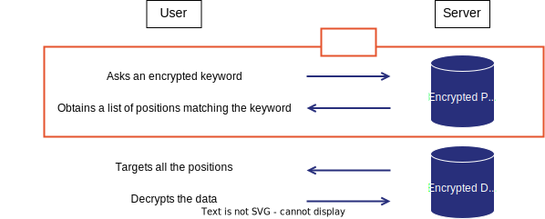
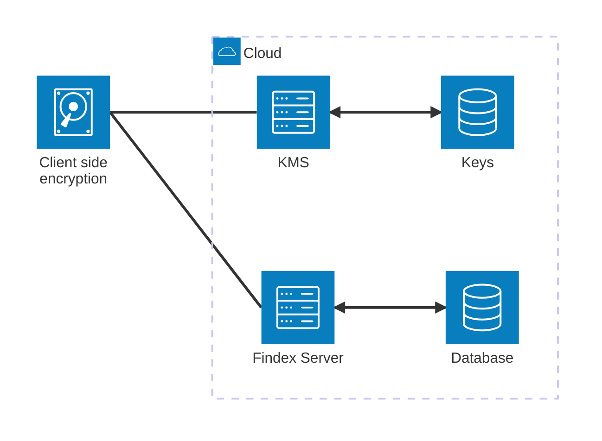

# Cosmian Findex server

- [Cosmian Findex server](#cosmian-findex-server)
  - [What is Findex?](#what-is-findex)
  - [What is Findex server?](#what-is-findex-server)
    - [Threat Model](#threat-model)
  - [Quick Start](#quick-start)
  - [Findex server](#findex-server)
    - [Client-Side Encryption](#client-side-encryption)
      - [How It Works](#how-it-works)
      - [Benefits](#benefits)
    - [Features](#features)

## What is Findex?

Findex is a cryptographic protocol designed to make search queries on an untrusted cloud server securely. Findex is concurrent and database-independent, allowing large database indexes to be outsourced securely without compromising usability.

Findex aims to solve the following problem:

> [!IMPORTANT]
> How to securely recover the _location_ of an encrypted data matching a given _keyword_?

Findex has been published as a scientific paper in the IACR ePrint archive: <https://eprint.iacr.org/2024/1541>.

## What is Findex server?

Findex server is a high-performance, open-source server application written in Rust that implements the Findex protocol and offers a REST API to store encrypted indexes and perform search queries on them.  Findex Server mainly is an authentication layer and therefore all data-critical manipulations are performed by a database.

The server is designed to be used in conjunction with the [Cosmian CLI](https://docs.cosmian.com/cosmian_cli), a command-line interface that allows users to interact with the server.

### Threat Model

The threat model for Findex assumes that the cloud server is untrusted and may attempt to infer information from the encrypted indexes and search queries. However, the server is considered honest-but-curious, meaning it will follow the protocol correctly but will try to learn as much as possible from the data it processes. Findex is designed to protect against such adversaries by ensuring that no useful information about the plaintext data and the minimum of information is leaked during search queries.

> [!IMPORTANT]
> Basically, the server does not know how are encrypted the indexes nor the datasets they contain. It can only perform search queries on the encrypted indexes and return the results to the client.

## Quick Start

For [Findex server](./documentation/docs/quick_start.md).

For [Cosmian CLI](./documentation/docs/quick_start_client.md).

## Findex server

**Findex server** cannot be described without mentioning the principle of what is **client-side encryption**, since client is responsible of encrypting the data before sending it to the server.

### Client-Side Encryption

Client-side encryption is a crucial aspect of the Findex protocol, ensuring that data remains secure even when stored on an untrusted server. In this model, all encryption and decryption operations are performed on the client side, meaning that the server only ever sees encrypted data and cannot infer any useful information from it.

#### How It Works

1. **Data Encryption**: Before sending any data to the Findex server, the client encrypts the data using a secure encryption algorithm. This ensures that the plaintext data is never exposed to the server.

2. **Index Encryption**: Similarly, the indexes used for search queries are also encrypted on the client side. This prevents the server from learning anything about the content of the indexes.

3. **Search Queries**: When performing a search query, the client encrypts the search keyword and sends the encrypted query to the server. The server processes the query on the encrypted indexes and returns the encrypted results to the client.

4. **Data Decryption**: Upon receiving the encrypted results from the server, the client decrypts the data to obtain the plaintext results.

#### Benefits

- **Data Privacy**: Since the server only handles encrypted data, it cannot access the plaintext information, ensuring data privacy.
- **Security**: Client-side encryption protects against potential data breaches on the server, as the encrypted data would be useless to an attacker without the decryption keys.
- **Control**: Users retain full control over their encryption keys and can manage their own security policies.
- **Database Independence**: Findex server is designed to work with any database, as the encryption and decryption operations are performed independently of the underlying storage mechanism. It relies on state-of-the-art solutions like Redis and can therefore provide a strong data-persistence insurance. An identified issue in the existing SSE literature is that all schemes rely on ad-hoc server implementations, which increases the probability of bugs, crashes and data-loss. In comparison, Findex Server is "just" a glorified Redis, which is good.

By leveraging client-side encryption, Findex ensures that sensitive data remains secure and private, even when stored and processed on an untrusted server.

The Findex server, written in Rust and using the Actix-web framework, is a REST-API server used to store encrypted indexes and perform search queries on them. It is designed to be used in conjunction with the [Cosmian CLI](https://docs.cosmian.com/cosmian_cli), which is a command-line interface that allows users to interact with the server.

### Features

The server offers a REST API with the following functionalities:

- [User Authentication](./documentation/docs/authentication.md)
- [User access authorization](./documentation/docs/authorization.md)
- [Encrypted database and indexes](./documentation/docs/database.md)
