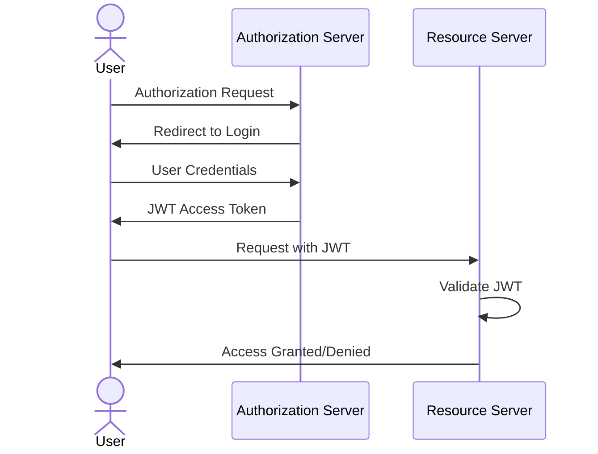

# User Authentication

The application supports two methods of user authentication:

- [Open ID Connect](https://openid.net/connect/) with [JWT access tokens](https://jwt.io/)
- PKCS12 certificates with mutual authentication (client ↔ server)

## OpenID with JWT Access Token

In that case, the Findex server delegates the authentication process to an external OAuth2 server. In fine, the server issues a JWT Access Token that is used to authenticate the user with the Findex server.

!!! warning
    The Findex server must be run with the following arguments:
    For example with Google OAuth2:
    ```sh
    docker run -p 6668:6668 --name findex-server ghcr.io/cosmian/findex-server:latest \
               --jwt-issuer-uri=https://accounts.google.com \
               --jwks-uri=https://www.googleapis.com/oauth2/v3/certs \
               --jwt-audience=cosmian_findex_server
    ```

The authentication Flow can be summarized as follows:

1. Client Requests Authorization:

    The client application initiates an authorization request. This is done via an OAuth 2.0 Authorization Code Flow. The client redirects the user to the Authorization Server (e.g., Google, GitHub, or a custom server) that has to be owned by the client.

2. User Authenticates:

    The user authenticates with their credentials (e.g., username/password, social login). The Authorization Server verifies the user's identity.

3. Access Token Issuance (JWT)

    The Authorization Server issues an Access Token in the form of a JWT. The token contains:

    - Header: Token type (JWT) and signing algorithm (e.g., RS256).
    - Payload (Claims): User information, permissions, expiration time (exp), issuer (iss), audience (aud), etc.
    - Signature: Ensures the integrity and authenticity of the token.

4. Client Accesses Protected Resources

    The client includes the JWT in the Authorization header of HTTP requests to the Resource Server:

    ```html
    Authorization: Bearer <JWT Access Token>
    ```

5. Token Validation

    The Resource Server validates the JWT by:

    - Verifying the signature (using a public key if signed with RS256).
    - Checking standard claims (e.g., exp, iss, aud) for validity.
    - Decoding the payload to extract user information and permissions.

6. Access Granted or Denied

    If the JWT is valid, the Resource Server allows access to the requested resources based on the user's claims. If invalid (e.g., expired, tampered), the request is denied with an HTTP 401 Unauthorized error.



!!! info
    JWT is a compact, URL-safe means of representing claims to be transferred between two parties. The claims in a JWT are encoded as a JSON object that is used as the payload of a JSON Web Signature (JWS) structure or as the plaintext of a JSON Web Encryption (JWE) structure. This enables the claims to be digitally signed or integrity protected with a Message Authentication Code (MAC) and/or encrypted.

Cosmian CLI is helpful to authenticate with the Findex server using OpenID Connect.

!!! info
    The Cosmian CLI realizes this authentication flow using this simple command:
    ```sh
    cosmian findex login
    ```

## X509 certificates authentication

In that case, the Findex server uses PKCS12 certificates to authenticate the user. The server requires the client to present a certificate signed by a trusted authority known by itself. The server also presents its own certificate to the client, which the client must verify.

!!! warning
    The Findex server must be run with the following arguments:
    For example with Google OAuth2:
    ```sh
    docker run -p 6668:6668 --name findex-server ghcr.io/cosmian/findex-server:latest \
               --https-p12-file=server/certificate.p12 \
               --https-p12-password=complex_password \
               --authority-cert-file=server/ca.crt
    ```
