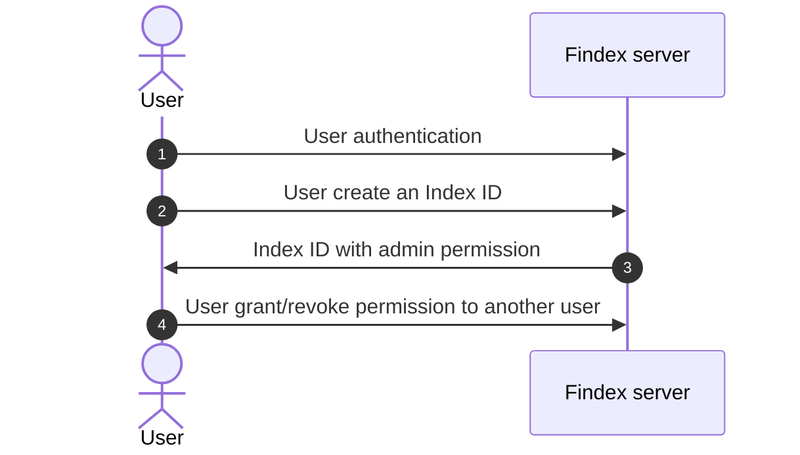

# User access authorization

Once authenticated, users must have an authorization to an **Index ID**.

## What is an Index ID?

An **Index ID** allows the partitioning of indexed data: behind an **Index ID**, there are:

- encrypted indexes
- and the encrypted version of the data that has been indexed.

This **Index ID** can be shared between users, with a specific permission. Users can also own multiple Index IDs.

For each server's endpoint, the server checks the user's permissions before allowing access to the index.

## Permissions

There are 3 permissions:

- `reader`
- `writer`
- `admin`

The mechanism is pretty simple:

When a user create a new **Index ID**, he becomes the **admin** of this index. He can then grant other users to the index with a role of **reader**, **writer** or **admin**.

Every server endpoint is protected by this authorization mechanism: the server checks the user's role before allowing access to the endpoint.

## Endpoints

| Endpoint                                              | Description                                       |
| ----------------------------------------------------- | ------------------------------------------------- |
| `/create/index`                                       | Create an **Index ID**                            |
| `/permission/grant/{user_id}/{permission}/{index_id}` | Grant a permission to a user for a specific index |
| `/permission/list/{user_id}`                          | List permissions of a user                        |
| `/permission/revoke/{user_id}/{index_id}`             | Revoke a user's permission for a specific index   |
