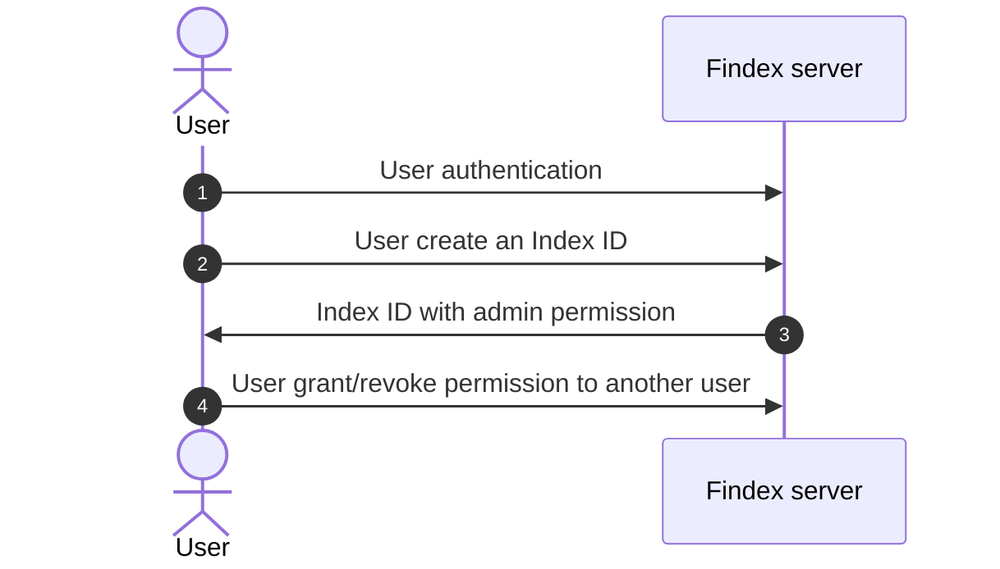

# User access authorization

Once authenticated, users must have an authorization to an **Index ID**.

## What is an Index ID?

An **Index ID** allows the partitioning of indexed data: behind an **Index ID**, there are:

- encrypted indexes
- and the encrypted version of the data that has been indexed.

This **Index ID** can be shared between users, with a specific permission. Users can also own multiple Index IDs.

Invocation of any method exposed in the API is conditioned by the validation and compatibility of the claimed permissions.

## Permissions

There are 3 permissions:

- `reader`
- `writer`
- `admin`

The mechanism is pretty simple:

When a user creates a new **Index ID**, he becomes the **admin** of this index. He can then grant other index users the role of **reader**, **writer** or **admin**.

Every server endpoint is protected by this authorization mechanism: the server checks the user's role before allowing access to the endpoint.

### Permission format in database

Currently, there is an entry for each user in database. In the case of a key-value database, the key is the user ID (its email) and the value is a list of tuples `(permission, index_id)` where `permission` is 1 byte and `index_id` is an UUID of 16 bytes.

#### Example

| Key              | Value                                                                                          |
| ---------------- | ---------------------------------------------------------------------------------------------- |
| `user@gmail.com` | (0,d9eee59c-f9df-4edd-97bc-ba5952ce63af) \| (1,5b044b87-bced-424c-9dac-f25550c88c20) |

## Endpoints

| Endpoint                                              | Description                                       |
| ----------------------------------------------------- | ------------------------------------------------- |
| `/create/index`                                       | Create an **Index ID**                            |
| `/permission/grant/{user_id}/{permission}/{index_id}` | Grant a permission to a user for a specific index |
| `/permission/list/{user_id}`                          | List permissions of a user                        |
| `/permission/revoke/{user_id}/{index_id}`             | Revoke a user's permission for a specific index   |
