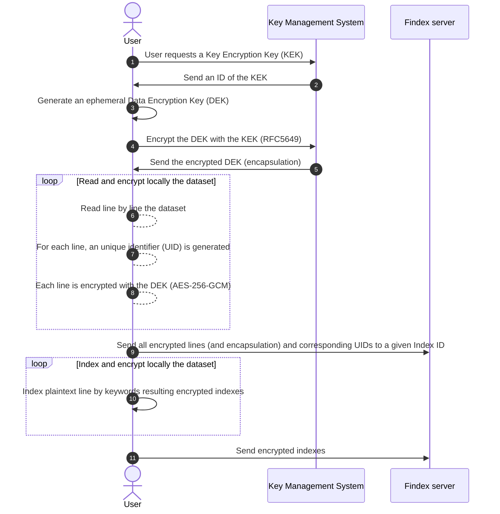
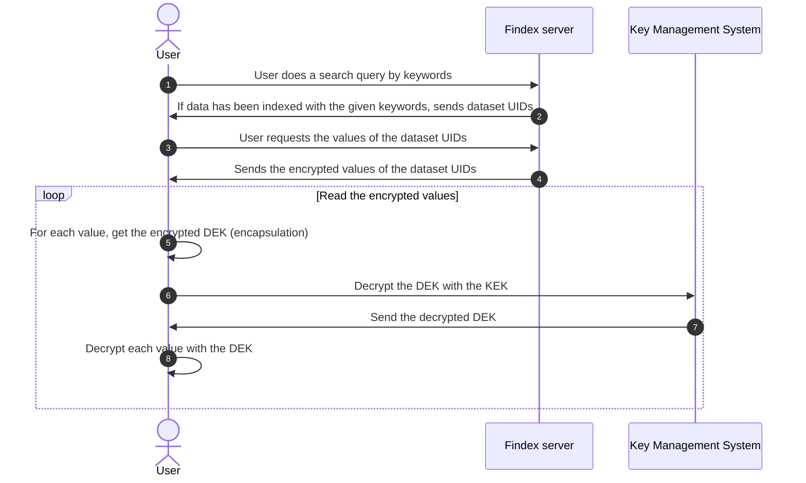

# Encrypted database

From the server's perspective, only encrypted data is received and stored as-is. The server does not know how the data is encrypted and cannot decrypt it.

The requirements database is a key-value store where the keys are unique identifiers (UIDs) and the values are the encrypted indexes or datasets.

In this scenario, the user is responsible for encrypting the data before sending it to the server. A hybrid encryption scheme is used, where the data is encrypted with a Data Encryption Key (DEK) and the DEK is encrypted with a Key Encryption Key (KEK).

User requires a Key Management System to encrypt the Data Encryption Key (DEK).

## How to securely index new data?

!!! info
    The user is already authenticated and has the `write` permission to a given index.

!!! warning
    For now, only Redis database is supported.

## How to securely search indexed data?

!!! info
    The user is already authenticated and has the `write` permission to a given index.

### Store and retrieve encrypted indexes as Findex requirements

According the Findex REST client implementation found in [cloudproof_rust](https://github.com/Cosmian/cloudproof_rust), the server presents the following endpoints:

| Endpoint                             | Description                 |
| ------------------------------------ | --------------------------- |
| `/indexes/{index_id}/fetch_entries`  | retrieve encrypted indexes  |
| `/indexes/{index_id}/fetch_chains`   | retrieve encrypted indexes  |
| `/indexes/{index_id}/upsert_entries` | insert encrypted indexes    |
| `/indexes/{index_id}/insert_chains`  | insert encrypted indexes    |
| `/indexes/{index_id}/delete_entries` | delete encrypted indexes    |
| `/indexes/{index_id}/delete_chains`  | delete encrypted indexes    |
| `/indexes/{index_id}/dump_tokens`    | print the encrypted indexes |

The encryption is done by the client before sending the data to the server.

### Store and retrieve the encrypted version of the data that has been indexed

Findex server stores as it is the encrypted version of the data that has been indexed. The server presents the following endpoints:

| Endpoint                                    | Description                  |
| ------------------------------------------- | ---------------------------- |
| `/datasets/{index_id}/datasets_add_entries` | insert new encrypted entries |
| `/datasets/{index_id}/datasets_del_entries` | delete encrypted entries     |
| `/datasets/{index_id}/datasets_get_entries` | get encrypted entries        |

The encryption is done by the client before sending the data to the server.
