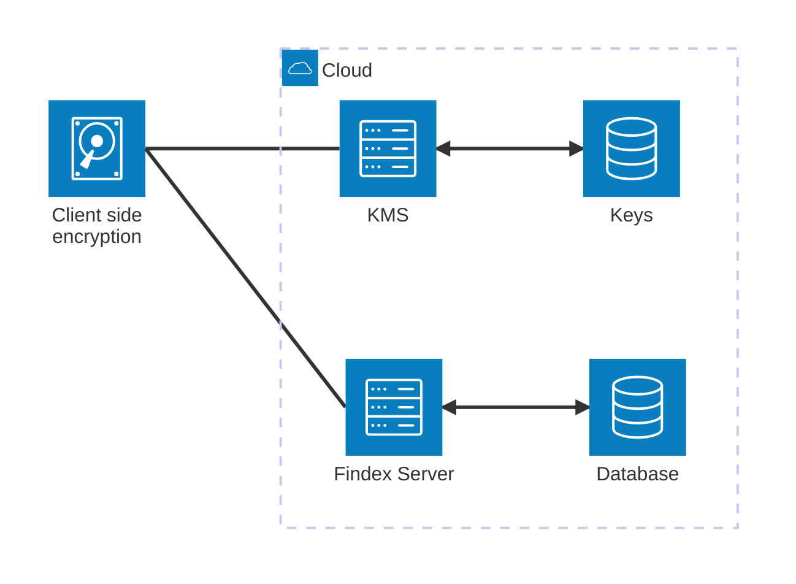

# Cosmian Findex server

The Cosmian Findex is a high-performance, [**open-source**](https://github.com/Cosmian/findex-server), server application
written in [**Rust**](https://www.rust-lang.org/) that provides a REST API.

- [Cosmian Findex server](#cosmian-findex-server)
  - [What is Findex?](#what-is-findex)
  - [What is Findex server?](#what-is-findex-server)
    - [Attacking Model](#attacking-model)
  - [Quick Start](#quick-start)
    - [Docker](#docker)
    - [Pre-built binaries](#pre-built-binaries)
    - [From source](#from-source)
  - [Findex server](#findex-server)
    - [Client-Side Encryption](#client-side-encryption)
      - [How It Works](#how-it-works)
      - [Benefits](#benefits)
    - [Features](#features)

## What is Findex?

Findex is a cryptographic protocol designed to make search queries on an untrusted cloud server securely. Findex is concurrent and database-independent, allowing large database indexes to be outsourced securely without compromising usability.

Findex aims to solve the following problem:

> [!IMPORTANT]
> How to securely recover the _location_ of an encrypted data matching a given _keyword_?

Findex has been published as a scientific paper in the IACR ePrint archive: <https://eprint.iacr.org/2024/1541>.

## What is Findex server?


Findex server is a high-performance, open-source server application written in Rust that implements the Findex protocol and offers a REST API to store encrypted indexes and perform search queries on them. The server is designed to be used in conjunction with the Findex CLI, a command-line interface that allows users to interact with the server.

### Attacking Model

The attacking model for Findex assumes that the cloud server is untrusted and may attempt to infer information from the encrypted indexes and search queries. However, the server is considered honest-but-curious, meaning it will follow the protocol correctly but will try to learn as much as possible from the data it processes. Findex is designed to protect against such adversaries by ensuring that no useful information about the plaintext data or search queries is leaked.

> [!IMPORTANT]
> Basically, the server does not know how are encrypted the indexes nor the datasets they contain. It can only perform search queries on the encrypted indexes and return the results to the client.

## Quick Start

Multiple options are available to run the Findex server, including using Docker, pre-built binaries, or building from source.

> [!WARNING]
> No authentication is configured for quick start. This is not recommended for production use.

### Docker

The quickest way to get started with Findex server is to use the Docker image. To run the server binary on `http://localhost:6668` that stores its data
in a Redis server, run the following command:

```sh
docker compose -f docker-compose-quick-start.yml up
```

where `docker-compose-quick-start.yml` is the following:

```yaml
services:
  redis:
    container_name: redis
    image: redis:latest
    ports:
      - 6379:6379
  findex-server:
    container_name: findex-server
    image: ghcr.io/cosmian/findex-server:0.1.0
    ports:
      - 6668:6668
    environment:
      FINDEX_SERVER_DATABASE_TYPE: redis
      FINDEX_SERVER_DATABASE_URL: redis://redis:6379
      FINDEX_SERVER_CLEAR_DATABASE: true

```

### Pre-built binaries

An other option include running the server binary directly or building it from source: pre-built binaries [are available](https://package.cosmian.com/findex-server/0.1.0/) for Linux, MacOS, and Windows.

First, run the Redis server independently:

```sh
docker run -d -p 6379:6379 redis
```

Then, download the binary for your platform and run it:

```sh
wget https://package.cosmian.com/findex-server/0.1.0/ubuntu_24_04-release.zip
unzip ubuntu_24_04-release.zip
./ubuntu_24_04-release/cosmian_findex_server -- --database-url redis://localhost:6379 --database-type redis
```

The server should now be running on `http://localhost:6668`.

### From source

To build the server from source, clone the repository and run the following commands:

```sh
git clone https://github.com/Cosmian/findex-server.git
cd findex-server
cargo build
```

First, run the Redis server independently:

```sh
docker run -d -p 6379:6379 redis
```

Then, run the server:

```sh
cargo run --bin cosmian_findex_server -- --database-url redis://localhost:6379 --database-type redis
```

## Findex server

### Client-Side Encryption

Client-side encryption is a crucial aspect of the Findex protocol, ensuring that data remains secure even when stored on an untrusted server. In this model, all encryption and decryption operations are performed on the client side, meaning that the server only ever sees encrypted data and cannot infer any useful information from it.

#### How It Works

1. **Data Encryption**: Before sending any data to the Findex server, the client encrypts the data using a secure encryption algorithm. This ensures that the plaintext data is never exposed to the server.

2. **Index Encryption**: Similarly, the indexes used for search queries are also encrypted on the client side. This prevents the server from learning anything about the content of the indexes.

3. **Search Queries**: When performing a search query, the client encrypts the search keyword and sends the encrypted query to the server. The server processes the query on the encrypted indexes and returns the encrypted results to the client.

4. **Data Decryption**: Upon receiving the encrypted results from the server, the client decrypts the data to obtain the plaintext results.

#### Benefits

- **Data Privacy**: Since the server only handles encrypted data, it cannot access the plaintext information, ensuring data privacy.
- **Security**: Client-side encryption protects against potential data breaches on the server, as the encrypted data would be useless to an attacker without the decryption keys.
- **Control**: Users retain full control over their encryption keys and can manage their own security policies.

By leveraging client-side encryption, Findex ensures that sensitive data remains secure and private, even when stored and processed on an untrusted server.

The Findex server, written in Rust and using the Actix-web framework, is a REST-API server used to store encrypted indexes and perform search queries on them. It is designed to be used in conjunction with the Findex CLI, which is a command-line interface that allows users to interact with the server.



### Features

The server offers a REST API with the following functionalities:

- **User authentication**
- **User access authorization**
- **Store and retrieve encrypted indexes as Findex requirements**
- **Store and retrieve the encrypted version of the data that has been indexed**
